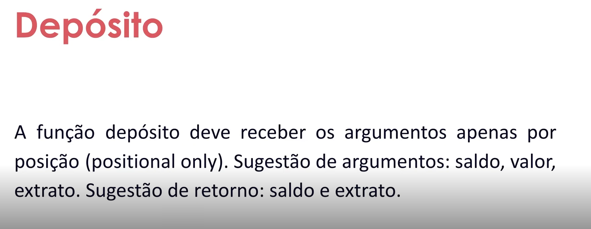
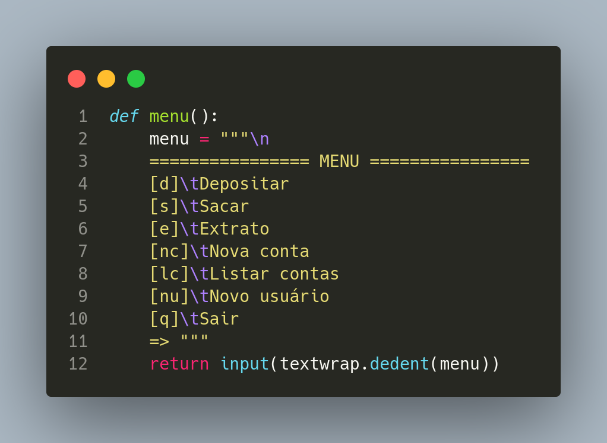
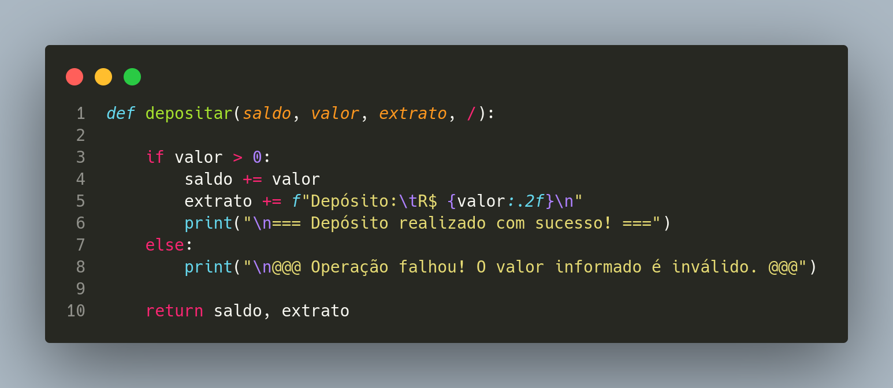
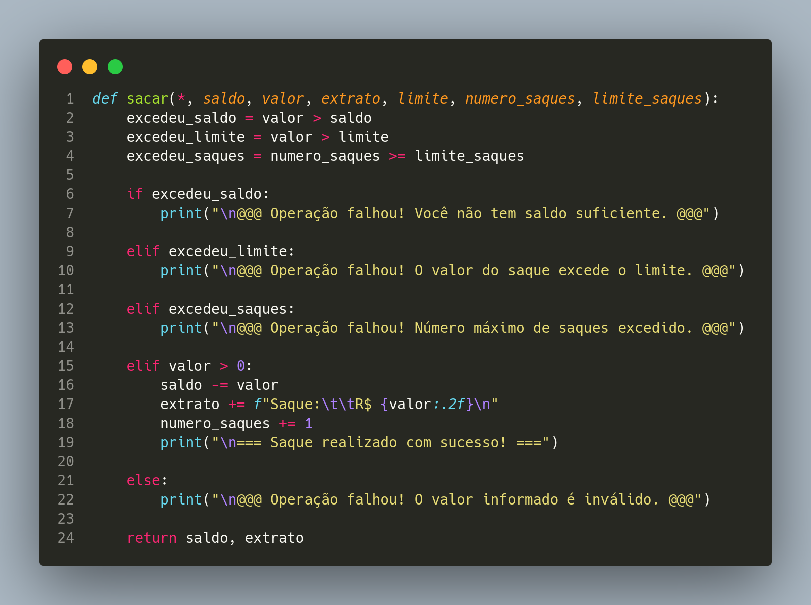
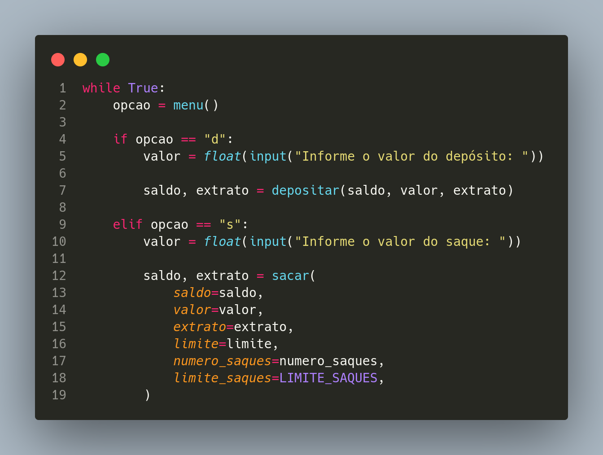
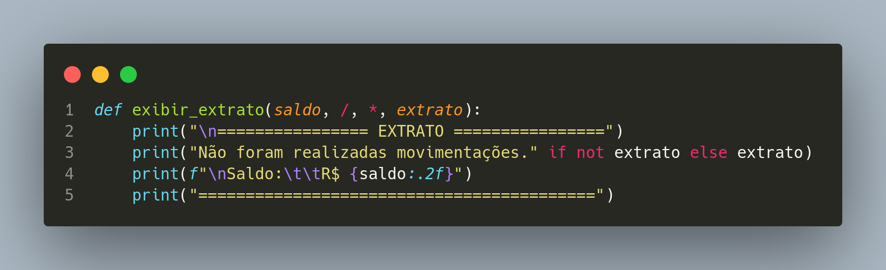
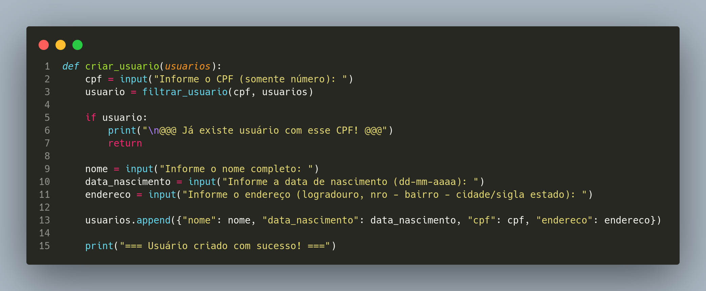
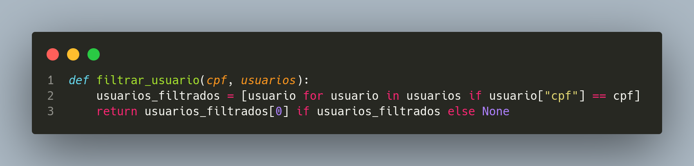
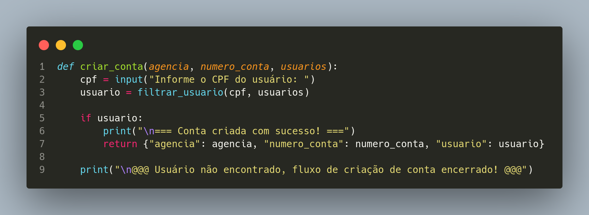

# Desafio - Otimizando o Sistema Bancário com Funções Python

- Instrutor: Guilherme Arthur de Carvalho (Analista de Sistemas)
- Contato Libkedin: https://www.linkedin.com/in/decarvalhogui/
- Linktree: https://linktr.ee/decarvalhogui

## Apresentação do Desafio

<p align="center">
    
</p>

<p align="center">
    
</p>

<p align="center">
    
</p>

<p align="center">
    
</p>

<p align="center">
    
</p>

<p align="center">
    
</p>

<p align="center">
    
</p>

<p align="center">
    
</p>

<p align="center">
    
</p>


### Arquivo utilizado neste módulo

- Arquivo `desafio.py` do módulo de Fundamentos

<details>
     <summary> 🟨🟨🟨 <h3>Código BASE do projeto&nbsp<h3> 🟨🟨🟨</summary>

```python
menu = """

[d] Depositar
[s] Sacar
[e] Extrato
[q] Sair

=> """

saldo = 0
limite = 500
extrato = ""
numero_saques = 0
LIMITE_SAQUES = 3

while True:

    opcao = input(menu)

    if opcao == "d":
        valor = float(input("Informe o valor do depósito: "))

        if valor > 0:
            saldo += valor
            extrato += f"Depósito: R$ {valor:.2f}\n"

        else:
            print("Operação falhou! O valor informado é inválido.")

    elif opcao == "s":
        valor = float(input("Informe o valor do saque: "))

        excedeu_saldo = valor > saldo

        excedeu_limite = valor > limite

        excedeu_saques = numero_saques >= LIMITE_SAQUES

        if excedeu_saldo:
            print("Operação falhou! Você não tem saldo suficiente.")

        elif excedeu_limite:
            print("Operação falhou! O valor do saque excede o limite.")

        elif excedeu_saques:
            print("Operação falhou! Número máximo de saques excedido.")

        elif valor > 0:
            saldo -= valor
            extrato += f"Saque: R$ {valor:.2f}\n"
            numero_saques += 1

        else:
            print("Operação falhou! O valor informado é inválido.")

    elif opcao == "e":
        print("\n================ EXTRATO ================")
        print("Não foram realizadas movimentações." if not extrato else extrato)
        print(f"\nSaldo: R$ {saldo:.2f}")
        print("==========================================")

    elif opcao == "q":
        break

    else:
        print("Operação inválida, por favor selecione novamente a operação desejada.")

```
</details>

## Solução Desafio

<details>
     <summary> 🟥🟥🟥 <h3>Código SOLUÇÃO do projeto&nbsp<h3> 🟥🟥</summary>

```python
import textwrap


def menu():
    menu = """\n
    ================ MENU ================
    [d]\tDepositar
    [s]\tSacar
    [e]\tExtrato
    [nc]\tNova conta
    [lc]\tListar contas
    [nu]\tNovo usuário
    [q]\tSair
    => """
    return input(textwrap.dedent(menu))


def depositar(saldo, valor, extrato, /):

    if valor > 0:
        saldo += valor
        extrato += f"Depósito:\tR$ {valor:.2f}\n"
        print("\n=== Depósito realizado com sucesso! ===")
    else:
        print("\n@@@ Operação falhou! O valor informado é inválido. @@@")

    return saldo, extrato


def sacar(*, saldo, valor, extrato, limite, numero_saques, limite_saques):
    excedeu_saldo = valor > saldo
    excedeu_limite = valor > limite
    excedeu_saques = numero_saques >= limite_saques

    if excedeu_saldo:
        print("\n@@@ Operação falhou! Você não tem saldo suficiente. @@@")

    elif excedeu_limite:
        print("\n@@@ Operação falhou! O valor do saque excede o limite. @@@")

    elif excedeu_saques:
        print("\n@@@ Operação falhou! Número máximo de saques excedido. @@@")

    elif valor > 0:
        saldo -= valor
        extrato += f"Saque:\t\tR$ {valor:.2f}\n"
        numero_saques += 1
        print("\n=== Saque realizado com sucesso! ===")

    else:
        print("\n@@@ Operação falhou! O valor informado é inválido. @@@")

    return saldo, extrato


def exibir_extrato(saldo, /, *, extrato):
    print("\n================ EXTRATO ================")
    print("Não foram realizadas movimentações." if not extrato else extrato)
    print(f"\nSaldo:\t\tR$ {saldo:.2f}")
    print("==========================================")


def criar_usuario(usuarios):
    cpf = input("Informe o CPF (somente número): ")
    usuario = filtrar_usuario(cpf, usuarios)

    if usuario:
        print("\n@@@ Já existe usuário com esse CPF! @@@")
        return

    nome = input("Informe o nome completo: ")
    data_nascimento = input("Informe a data de nascimento (dd-mm-aaaa): ")
    endereco = input("Informe o endereço (logradouro, nro - bairro - cidade/sigla estado): ")

    usuarios.append({"nome": nome, "data_nascimento": data_nascimento, "cpf": cpf, "endereco": endereco})

    print("=== Usuário criado com sucesso! ===")


def filtrar_usuario(cpf, usuarios):
    usuarios_filtrados = [usuario for usuario in usuarios if usuario["cpf"] == cpf]
    return usuarios_filtrados[0] if usuarios_filtrados else None


def criar_conta(agencia, numero_conta, usuarios):
    cpf = input("Informe o CPF do usuário: ")
    usuario = filtrar_usuario(cpf, usuarios)

    if usuario:
        print("\n=== Conta criada com sucesso! ===")
        return {"agencia": agencia, "numero_conta": numero_conta, "usuario": usuario}

    print("\n@@@ Usuário não encontrado, fluxo de criação de conta encerrado! @@@")


def listar_contas(contas):
    for conta in contas:
        linha = f"""\
            Agência:\t{conta['agencia']}
            C/C:\t\t{conta['numero_conta']}
            Titular:\t{conta['usuario']['nome']}
        """
        print("=" * 100)
        print(textwrap.dedent(linha))


def main():
    LIMITE_SAQUES = 3
    AGENCIA = "0001"

    saldo = 0
    limite = 500
    extrato = ""
    numero_saques = 0
    usuarios = []
    contas = []

    while True:
        opcao = menu()

        if opcao == "d":
            valor = float(input("Informe o valor do depósito: "))

            saldo, extrato = depositar(saldo, valor, extrato)

        elif opcao == "s":
            valor = float(input("Informe o valor do saque: "))

            saldo, extrato = sacar(
                saldo=saldo,
                valor=valor,
                extrato=extrato,
                limite=limite,
                numero_saques=numero_saques,
                limite_saques=LIMITE_SAQUES,
            )

        elif opcao == "e":
            exibir_extrato(saldo, extrato=extrato)

        elif opcao == "nu":
            criar_usuario(usuarios)

        elif opcao == "nc":
            numero_conta = len(contas) + 1
            conta = criar_conta(AGENCIA, numero_conta, usuarios)

            if conta:
                contas.append(conta)

        elif opcao == "lc":
            listar_contas(contas)

        elif opcao == "q":
            break

        else:
            print("Operação inválida, por favor selecione novamente a operação desejada.")


main()

```
</details>

## Análise Passo a Passo das Funções Implementadas

### 🔘 Função __menu()__

<p align="center">
    
</p>

- A função menu usa `textwrap.dedent` para remover a indentação extra à esquerda. Existe apenas por organização visual do código Python. Isso garante que o menu seja exibido corretamente no terminal, sem espaços desnecessários no início das linhas.

- A instrução `return input(textwrap.dedent(menu))` mostra o menu ao usuário e retorna o valor digitado como string.

### 🔘 Função __depositar()__ 

<p align="center">
    
</p>

- A função depositar deve:
    - Receber argumentos apenas por posição (positional only);
    - Ter como argumentos: saldo, valor, extrato;
    - Retornar: saldo e extrato.

- 🔴 O símbolo **/** indica que todos os argumentos antes dele só podem ser passados **POR POSIÇÃO**, ou seja, não podem ser nomeados na chamada da função.

- Exemplos:

```
    depositar(1000, 200, "") # ✅ Correto
    depositar(saldo=1000, valor=200, extrato="")  # 📛 Vai gerar erro
```

- Foi criada uma codificação para a saída:

    - Três iguais "===" significam uma mensagem se SUCESSO.
    - Três arrobas "@@@" significam uma mensagem de FALHA.

### 🔘 Função __sacar()__

<p align="center">
    
</p>

- De acordo com a proposta de projeto, a função __saque__ deve receber os argumentos **APENAS POR NOME** (keyword only).

- O código está de acordo com esse requisito:

```
    def sacar(*, saldo, valor, extrato, limite, numero_saques, limite_saques):
```

- O uso do asterisco (__*__) antes dos parâmetros obriga que todos os argumentos seguintes sejam passados por nome, o que define exatamente a chamada keyword-only.

- Leitura do valor do saque e chamada da função __saque__:

<p align="center">
    
</p>

- Passagem dos argumentos __APENAS POR NOME__ (__keyword only__):

<p align="center">
    
</p>

### 🔘 Função __exibir_extato()__

<p align="center">
    
</p>

- A função extrato deve receber os argumentos por posição e nome (positional only e keyword only).

    - Argumento posicional: saldo
    - Argumento nomeado (keyword only): extrato

- Implementação no código:

<p align="center">
    
</p>

- Essa assinatura significa:

    - __saldo__ deve ser passado POR POSIÇÃO (por causa da barra /)
    - __extrato__ deve ser passado POR NOME (por causa do asterisco *)

- Exemplo de chamada correta no código:

```
    exibir_extrato(saldo, extrato=extrato)
```

### 🔘 Função __criar_usuario()__

<p align="center">
    
</p>

- Cada usuário deve conter:

    - nome
    - data de nascimento
    - CPF (apenas números)
    - endereço no formato:
        - logradouro, nro - bairro - cidade/sigla estado

- Não pode haver dois usuários com o mesmo CPF.

#### Função __filtrar_usuário()__ (chamada por __criar_usuario()__)

<p align="center">
    
</p>

- A primeira coisa que a função __criar_usuário__ faz é pedir o CPF chamando, em seguida, a função __filtrar_usuário__ a fim de evitar a duplicidade

- Detalhes da função __criar_usuario__:

    - Armazena os __usuários__ em uma lista chamada usuarios.
    - Cada usuário é um dicionário com nome, data_nascimento, cpf, endereco.
    - O CPF é verificado via filtrar_usuario, o que evita duplicidade.
    - O endereço é coletado exatamente no formato solicitado.
    - O CPF é inserido como string numérica, sem formatação.

- 🟥 Observar que __usuarios__ está num formato de LISTA de DICIONÁRIOS.

    - Exemplo:

        ```
        usuarios = [
            {"nome": "João", "data_nascimento": "01-01-1990", "cpf": "12345678901", "endereco": "Rua A, 10 - Centro - São Paulo/SP"},
            {"nome": "Maria", "data_nascimento": "15-06-1985", "cpf": "98765432100", "endereco": "Av B, 123 - Bairro B - Rio de Janeiro/RJ"},
        ]
        ```

### 🔘 Função __criar_conta()__

<p align="center">
    
</p>

- Especificações:

    - Armanezar contas em uma lista
    - Uma conta deve ser composta por:
        - Agência
        - Nr. de conta
        - Usuário
    - O número da conta deve ser sequencial iniciando em 1
    - O número da agência deve ser fixo (ex:"0001")
    - O usuário pode ter mais de uma conta
    - Uma conta pertence a somente um usuário

- A instrução `if usuário:` verifica se o usuário foi encontrado com o CPF encontrado. Em caso positivo prossegue com a criação da conta.

- Se usuario for válido, então:
    - Exibe a mensagem “Conta criada com sucesso!”
    - Retorna um __DICIONÁRIO__ com os dados da nova conta, contendo:
        - agencia: constante, definida no início do código através da instrução `AGENCIA = "0001"`.
        - numero_conta: gerado automaticamnte pelo sistema, de forma incremental, através da instrução `numero_conta = len(contas) + 1`.
        - usuario: gerado através da função __criar_usuário__
